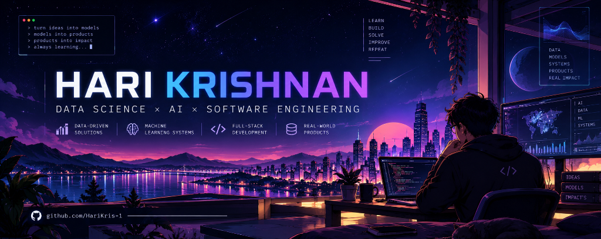

  <picture>
    <source media="(prefers-color-scheme: dark)" srcset="./art/banner-dark.png">
    
  </picture>

<h1 align="center">
  Hey there, I'm Hari
</h1>

  
  
  

<h2 align="center">👩‍💻 About Me</h2>

<table align="center">
<tr>

<td width="65%" valign="top">

- 💻 Computer Science & Engineering student specializing in Data Science.
- 🌱 Currently exploring Generative AI and Advanced Machine Learning Systems.
- 🚀 Building AI-powered products and contributing to intelligent workflows.
- 🎯 Goal: Transform complex data into accessible, real-world solutions.
- 🌌 Passionate about artificial intelligence, software engineering, and elegant code.
- ✨ Always learning, always building.
</td>

<td width="35%" align="center" valign="middle">

</td>

</tr>
</table>

<h2 align="center">💻 Tech Stack</h2>

<h2 align="center">📈 GitHub Analytics</h2>

<h2 align="center"> 🐍 Contribution Graph </h2>

<!--
To enable the snake animation:

1. Create a GitHub Action in this repository.
2. Use Platane/snk to generate the SVG every day.
3. Commit the generated file into:
   output/github-contribution-grid-snake.svg
-->

  <i>(Snake animation will appear here once the GitHub Action is configured)</i>

<h2 align="center">🌐 Let's Connect</h2>

See you in the next commit 🚀

